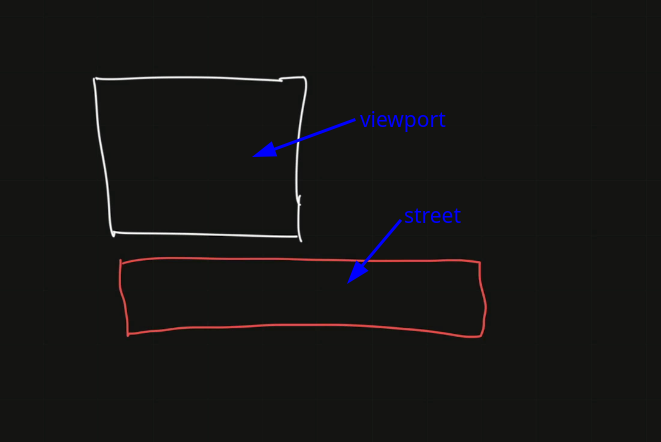
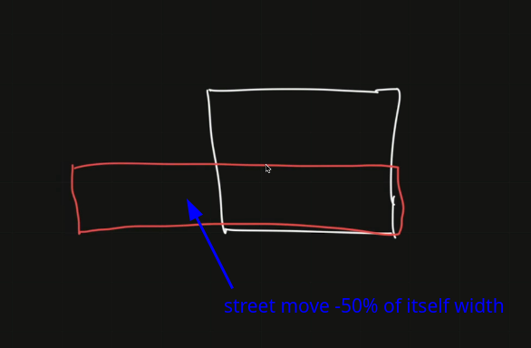

# Animation Exercise 3

```css
.ground {
  height: 50vh;
  position: relative;
}
.ground .street {
  background-image: linear-gradient(#464646, #242424);
  position: absolute;
  width: 200vw;
  height: 100%;
}
.ground .street .lines {
  position: absolute;
  background-image: url("./assets/line.png");
  background-size: 12.5% auto;
  background-repeat: repeat-x;
  background-position: 0 0;
  height: 4%;
  width: 100%;
  top: 50%;
  opacity: 0.8;
}
```

The above is the CSS code for the road in [animation exercise 1](./2025-08-10_animation-exercise-1.md). Now we want to make this road continuously shift to left in the viewport, so that we can simulate the effect of a person running on the road.






```css
.ground { /* ground is the container for the street inside the viewport, so we don't need to add any animation to it */
  height: 50vh;
  position: relative;
}
.ground .street {
  background-image: linear-gradient(#464646, #242424);
  position: absolute;
  width: 200vw;
  height: 100%;
  animation: moveStreet 10s linear infinite; /* apply the animation `run` on the street */
  /*                        ^^^^^^ street movement should be linear */
}
.ground .street .lines { /* lines are inside the street, so they will move with it */
  position: absolute;
  background-image: url("./assets/line.png");
  background-size: 12.5% auto;
  background-repeat: repeat-x;
  background-position: 0 0;
  height: 4%;
  width: 100%;
  top: 50%;
  opacity: 0.8;
}

/* create a keyframe animation for the street */
@keyframes moveStreet {
  0% {
    transform: translateX(0):
  }
  100% {
    transform: translateX(-50%);
    /*                    ^^^^ shift the street to the left by 50% of its width */
  }
}
