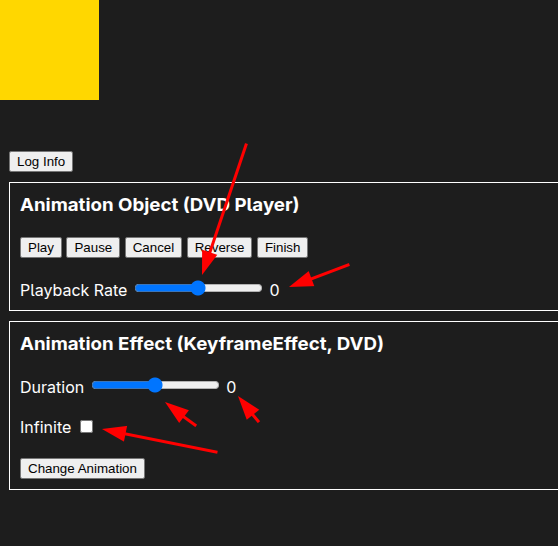
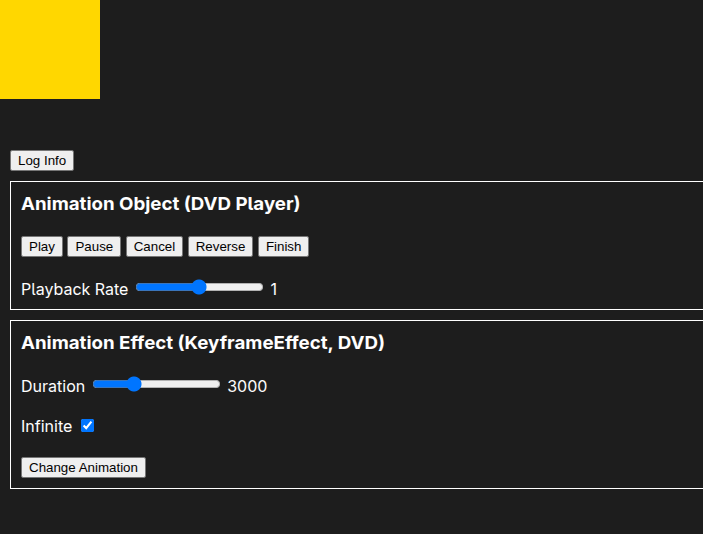

# Get Informations of Animations

Below, we add a button in the interface to obtain information about the animation object and animation effect.


```html
<!DOCTYPE html>
<html lang="en">
  <head>
    <!-- ... -->
  </head>
  <body>
    <div class="square"></div>
    <div class="controls">
      <button class="button logInfo">Log Info</button> <!-- Add button to log animation info -->
      <div class="section">
        <!-- buttons to use animation object methods -->
      </div>
      <div class="section">
        <!-- buttons to use animation effect methods -->
      </div>
    </div>
  </body>
</html>
```

```js
document.addEventListener("DOMContentLoaded", () => {
  const element = document.querySelector(".square");
  const squareAnimation = element.animate(
    //...
  );
  squareAnimation.pause();

  const buttons = document.querySelectorAll(".button");
  buttons.forEach((button) => {
    button.addEventListener("click", () => {
      //...

      // Log animation information
      if (button.classList.contains("logInfo")) {

        // information from the animation object
        console.log("currentTime:", squareAnimation.currentTime);
        console.log("startTime:", squareAnimation.startTime);
        console.log("playbackRate:", squareAnimation.playbackRate);
        console.log("playState:", squareAnimation.playState);

        // information from the animation effect
        console.log("keyframes:", squareAnimation.effect.getKeyframes());
        console.log("timing:", squareAnimation.effect.getTiming());
        console.log("computedTiming:", squareAnimation.effect.getComputedTiming());
      }
    });
  });
  //...
});
```

Here is the information before the animation starts playing:

```
currentTime: 0 <-- this presents the current time of the animation, it will be 0 before the animation starts, and it will be updated as the animation progresses (across iterations), and it's a bit like a progress because when you pause the animation, it will be paused as well.
startTime: null <-- this relies on the timeline, tells when the animation started at when the timeline is, we'll learn more about it on the other topics.
playbackRate: 1
playState: paused
keyframes: (3) [{…}, {…}, {…}]
timing: { <-- this is about the animation object options setting
    delay: 1000
    direction: "alternate"
    duration: 3000
    easing: "linear"
    endDelay: 0
    fill: "both"
    iterationStart: 0
    iterations: Infinity
}
computedTiming: { <-- this is computed by the browser based on the above `timing` object, so there are more properties
    activeDuration: Infinity <-- this will be computed with the formula: `duration * iterations`, so in this case it will be `3000 * Infinity = Infinity`
    currentIteration: 0
    delay: 1000
    direction: "alternate"
    duration: 3000
    easing: "linear"
    endDelay: 0
    endTime: Infinity <-- this is computed with the formula: `startTime + activeDuration + delay + endDelay`, so in this case it will be `null + Infinity + 1000 + 0 = Infinity`
    fill: "both"
    iterationStart: 0
    iterations: Infinity
    localTime: 0 <-- same as `currentTime`, so it will be 0 before the animation starts
    progress: 0 <-- this is the progress of the animation of current iteration, so it will be 0 before the animation starts
}
```

Information at the halfway point of the first iteration of the animation:

```
currentTime: 2834.163999999987
startTime: null
playbackRate: 1
playState: paused
keyframes: (3) [{…}, {…}, {…}]
timing: { <-- you can see that the timing object is the same as before because it does not compute anything, just holds the options
    "delay": 1000,
    "direction": "alternate",
    "duration": 3000,
    "easing": "linear",
    "endDelay": 0,
    "fill": "both",
    "iterationStart": 0,
    "iterations": null
}
computedTiming: {
    "delay": 1000,
    "direction": "alternate",
    "duration": 3000,
    "easing": "linear",
    "endDelay": 0,
    "fill": "both",
    "iterationStart": 0,
    "iterations": null,
    "activeDuration": null,
    "currentIteration": 0,
    "endTime": null,

    // above properties are computed by the fixed timing object properties, so they will be the same as before
    // but the following properties are computed based on the current time of the animation, so it will be different

    "localTime": 2834.163999999987, <-- same as `currentTime`, so it will be 2834.163999999987
    "progress": 0.6113879999999957 <-- this is the progress of the current iteration, so it will be 0.6113879999999957
}
```

Information at the halfway point of the second iteration of the animation:

```
currentTime: 5484.76199999999 <-- apparently, this value is accumulated from the previous iteration, so it will be `2834.163999999987 + 3000 = 5834.163999999987`
startTime: null
playbackRate: 1
playState: paused
keyframes: (3) [{…}, {…}, {…}]
timing: {
    "delay": 1000,
    "direction": "alternate",
    "duration": 3000,
    "easing": "linear",
    "endDelay": 0,
    "fill": "both",
    "iterationStart": 0,
    "iterations": null
}
computedTiming: {
    "delay": 1000,
    "direction": "alternate",
    "duration": 3000,
    "easing": "linear",
    "endDelay": 0,
    "fill": "both",
    "iterationStart": 0,
    "iterations": null,
    "activeDuration": null,
    "currentIteration": 1,
    "endTime": null,
    "localTime": 5484.76199999999, <-- same as `currentTime`, so it will be 5484.76199999999, and apparently it is accumulated from the previous iteration also
    "progress": 0.505079333333337 <-- this is the progress of the current iteration, so it will be 0.505079333333337, it is NOT accumulated from the previous iteration.
}
```

To prove that the `computedTiming` object is computed based on the `timing` object by the browser, we can set the `duration` to `auto` in the `timing` object to do the experiment:


```js
document.addEventListener("DOMContentLoaded", () => {
  const element = document.querySelector(".square");
  const squareAnimation = element.animate(
    [ ... ],
    {
      // duration: 3000,  <-- comment this line to use the `auto` duration
      delay: 1000,
      direction: "alternate",
      fill: "both",
      iterations: Infinity,
      easing: "linear",
      composite: "add",
      iterationComposite: "accumulate",
      timeline: document.timeline,
    }
  );
  // ...
});
```


```
timing: {
    "delay": 1000,
    "direction": "alternate",
    "duration": "auto", <-- duration is set to auto because `timing` object just simply holds the options
    "easing": "linear",
    "endDelay": 0,
    "fill": "both",
    "iterationStart": 0,
    "iterations": null
}
computedTiming: {
    "delay": 1000,
    "direction": "alternate",
    "duration": 0, <-- browser see the `auto` duration, and it computes the duration from `auto` to `0`
    "easing": "linear",
    "endDelay": 0,
    "fill": "both",
    "iterationStart": 0,
    "iterations": null,
    "activeDuration": 0,
    "currentIteration": 0,
    "endTime": 1000,
    "localTime": 0,
    "progress": 0
}
```

## Populate inputs with animation information



The above is the initial state of the app, where you can see that there are many inconsistencies between the information of animation object and animation effect. We can use the information of animation object and animation effect to initialize the values of these inputs, making them consistent with the information of animation object and animation effect.

```js
document.addEventListener("DOMContentLoaded", () => {
  const element = document.querySelector(".square");
  const squareAnimation = element.animate(...);
  squareAnimation.pause();

  const buttons = document.querySelectorAll(".button");
  buttons.forEach((button) => { ... });

  const playbackRateInput = document.getElementById("playbackRateInput");
  const playbackRateInputValue = document.getElementById(
    "playbackRateInputValue"
  );

  // Initialize playbackRateInput and playbackRateInputValue with the current playback rate from the animation object
  playbackRateInput.value = squareAnimation.playbackRate;
  playbackRateInputValue.value = squareAnimation.playbackRate;

  playbackRateInput.addEventListener("input", (e) => {
    squareAnimation.updatePlaybackRate(e.target.value);
    playbackRateInputValue.value = e.target.value;
  });

  const durationInput = document.getElementById("durationInput");
  const durationInputValue = document.getElementById("durationInputValue");

  // Initialize durationInput and durationInputValue with the current duration from the animation effect
  durationInput.value = squareAnimation.effect.getTiming().duration;
  durationInputValue.value = squareAnimation.effect.getTiming().duration;

  durationInput.addEventListener("input", (e) => {
    squareAnimation.effect.updateTiming({
      duration: +e.target.value,
    });
    durationInputValue.value = e.target.value;
  });

  const infiniteInput = document.getElementById("infiniteInput");

  // Initialize infiniteInput with the current iterations from the animation effect
  // by checking if iterations property is set to Infinity
  infiniteInput.checked = squareAnimation.effect.getTiming().iterations === Infinity;

  infiniteInput.addEventListener("change", (e) => {
    squareAnimation.effect.updateTiming({
      iterations: e.target.checked ? Infinity : 2,
    });
  });
});
```



