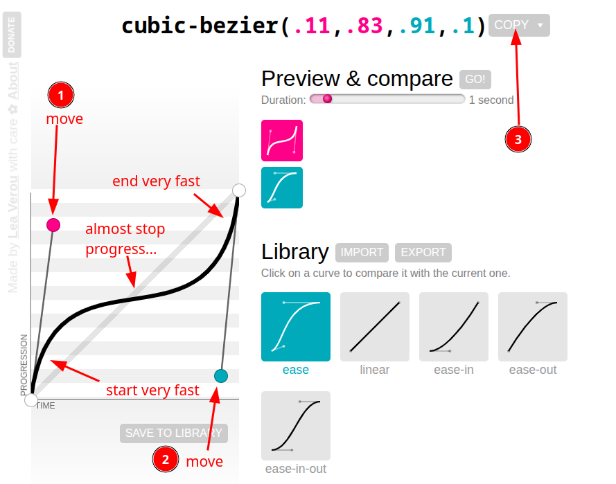
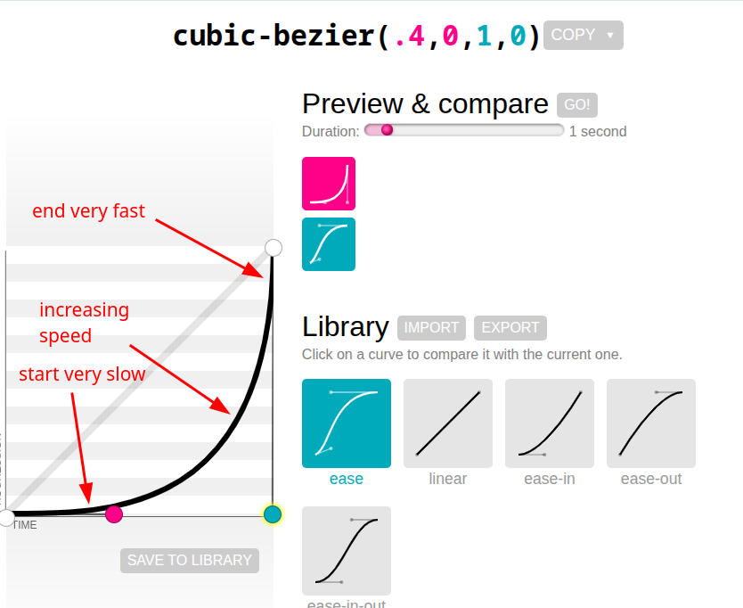
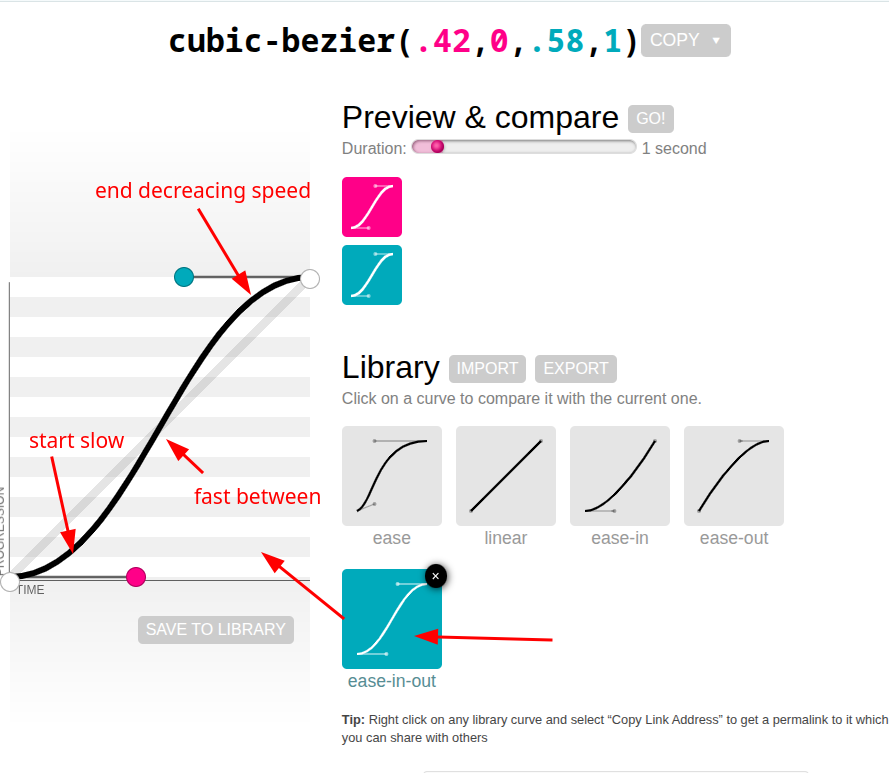

# cubic bezier timing function

## How to create smooth progress/time paths

In the [[2025-08-07_linear-timing-function|linear timing function]], I can use the linear timing function to create paths for various progress/time, but each segment is a straight line. If I need a smooth curve, I can use the cubic bezier timing function.

## Introduction to Cubic Bezier Timing Function

We can use below website to visualize and create cubic bezier curves:
https://cubic-bezier.com/

You can drag two control points to adjust the shape of the curve, and then directly copy the generated values into your CSS as follows.



```css
.element {
  width: 10px;
  height: 50px;
  background-color: greenyellow;
  transition: left 2s cubic-bezier(.11,.83,.91,.1);
  /*                  ^^^^^^^^^^^^^^^^^^^^^^^^^^^^ directly paste the values from the cubic-bezier.com website */
  left: -5px;
  position: absolute;
}
```

You can see that the first two parameters of the cubic bezier timing function represent the x and y coordinates of the first control point, and the last two parameters represent the x and y coordinates of the second control point. Then we can determine the overall progress/time variation from the slope of the obtained curve.



```css
.element {
  width: 10px;
  height: 50px;
  background-color: greenyellow;
  transition: left 2s cubic-bezier(.4,0,1,0);
  /*                  ^^^^^^^^^^^^^^^^^^^^^^ directly paste the values from the cubic-bezier.com website */
  left: -5px;
  position: absolute;
}
```

## Bouncing Effect

We can even use a cubic bezier timing function to create a bouncing effect, which can be used to simulate the feeling of an object bouncing on the ground.


```css
.element {
  width: 10px;
  height: 50px;
  background-color: greenyellow;
  transition: left 2s cubic-bezier(.28,-0.61,.72,1.44);
  /*                  ^^^^^^^^^^^^^^^^^^^^^^^^^^^^^ directly paste the values from the cubic-bezier.com website */
  left: -5px;
  position: absolute;
}
```

## Keyword Cubic Bezier Functions

We can use some keywords to represent some commonly used cubic bezier functions, such as ease-in, ease-out, ease-in-out, etc. Among them, ease represents easing, in represents start, out represents end, so ease-in-out means starting and ending slowly, and fast in the middle.



```css
.element {
  width: 10px;
  height: 50px;
  background-color: greenyellow;
  transition: left 2s cubic-bezier(.42,0,.58,1);
  /*                  ^^^^^^^^^^^^^^^^^^^^^^^^^ directly paste the values from the cubic-bezier.com website */
  /*                                            the effect is the same as ease-in-out */
  left: -5px;
  position: absolute;
}
```

