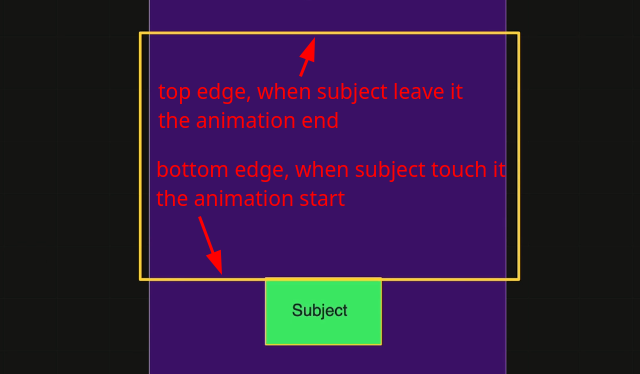
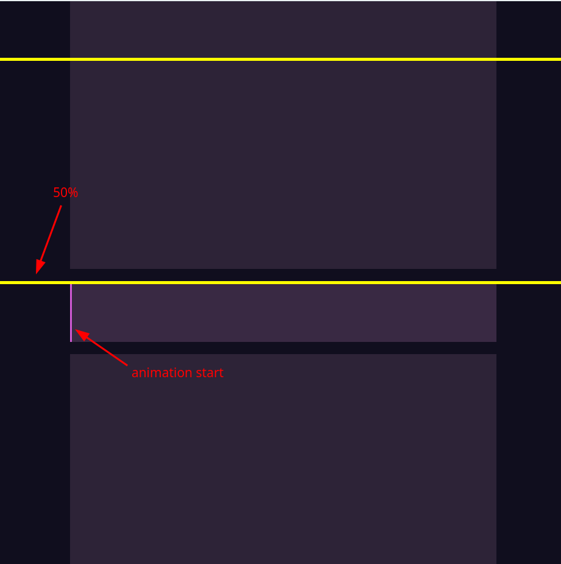
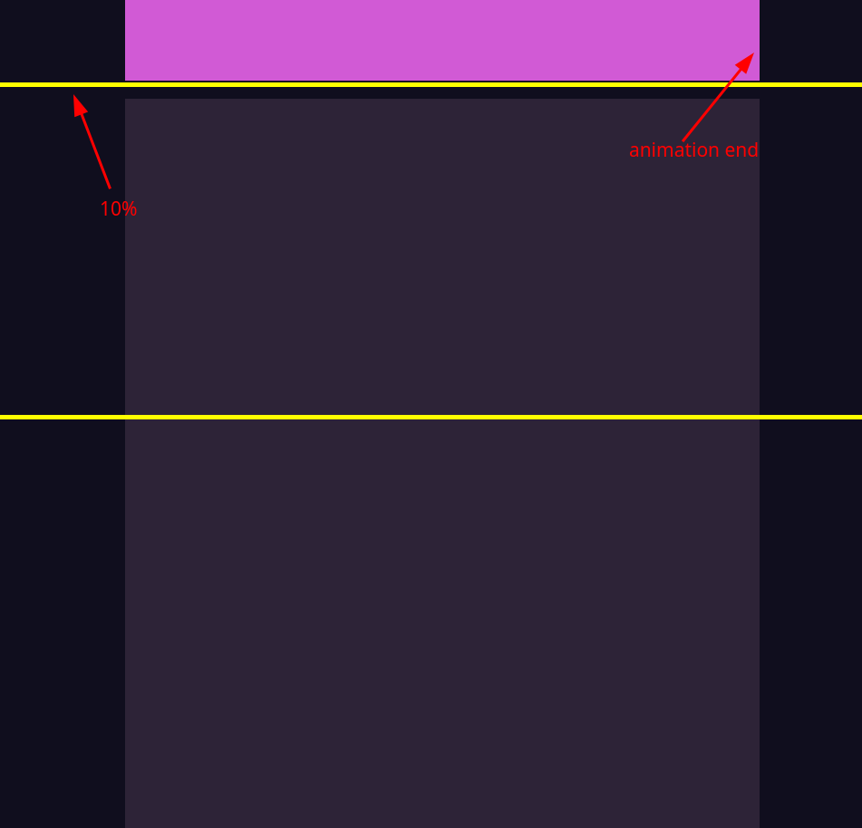
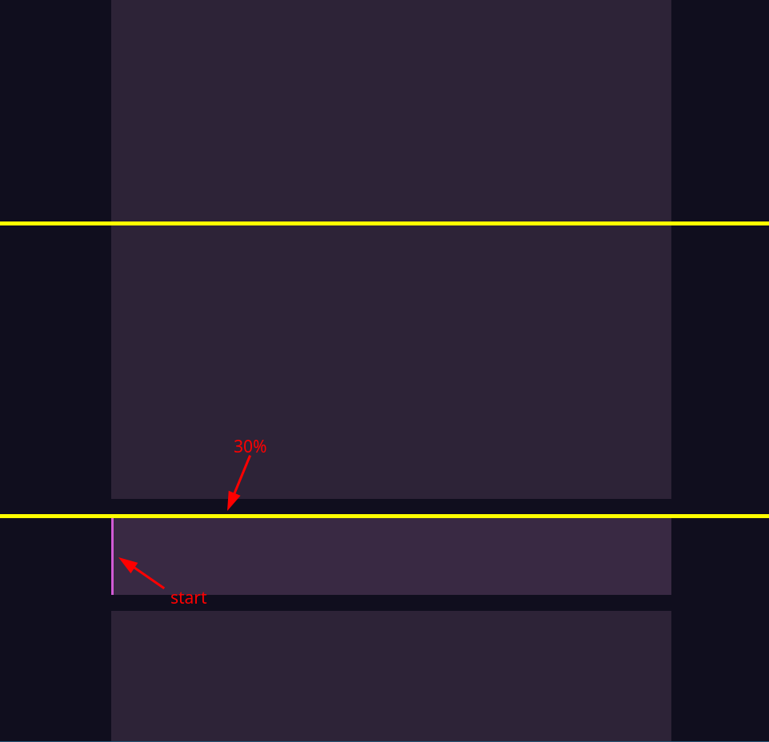
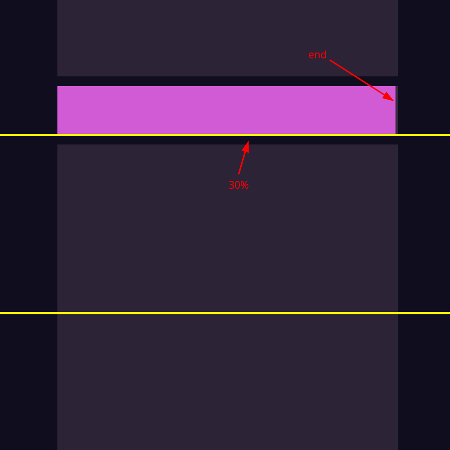
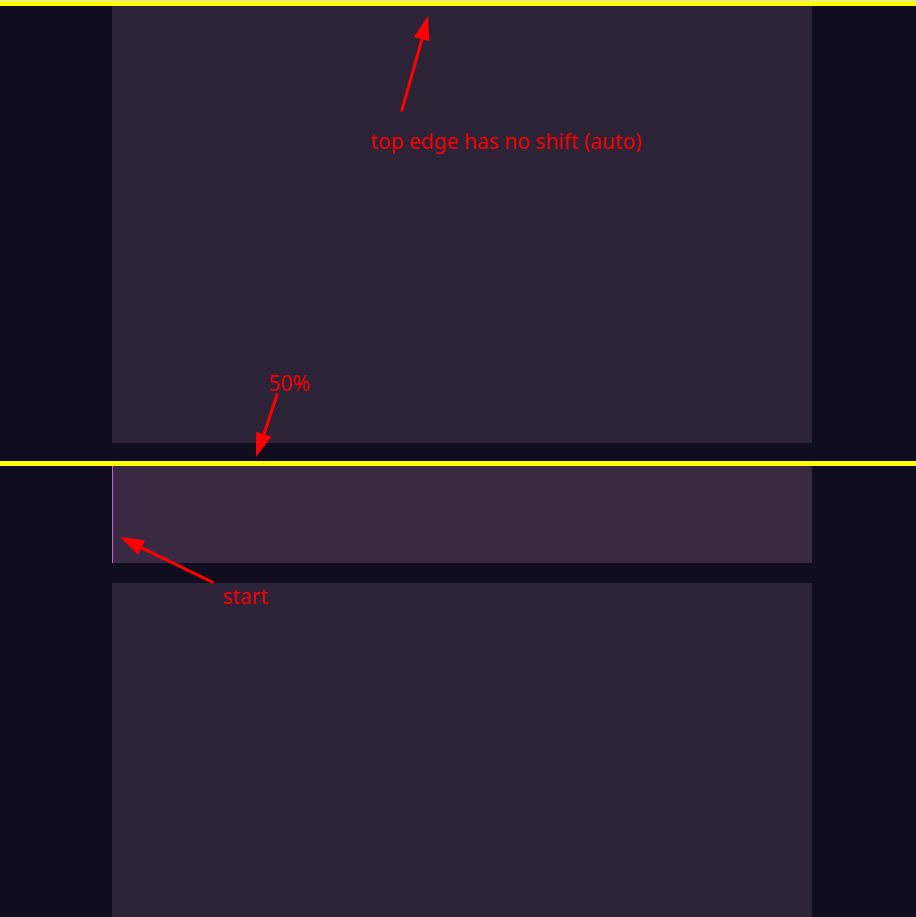
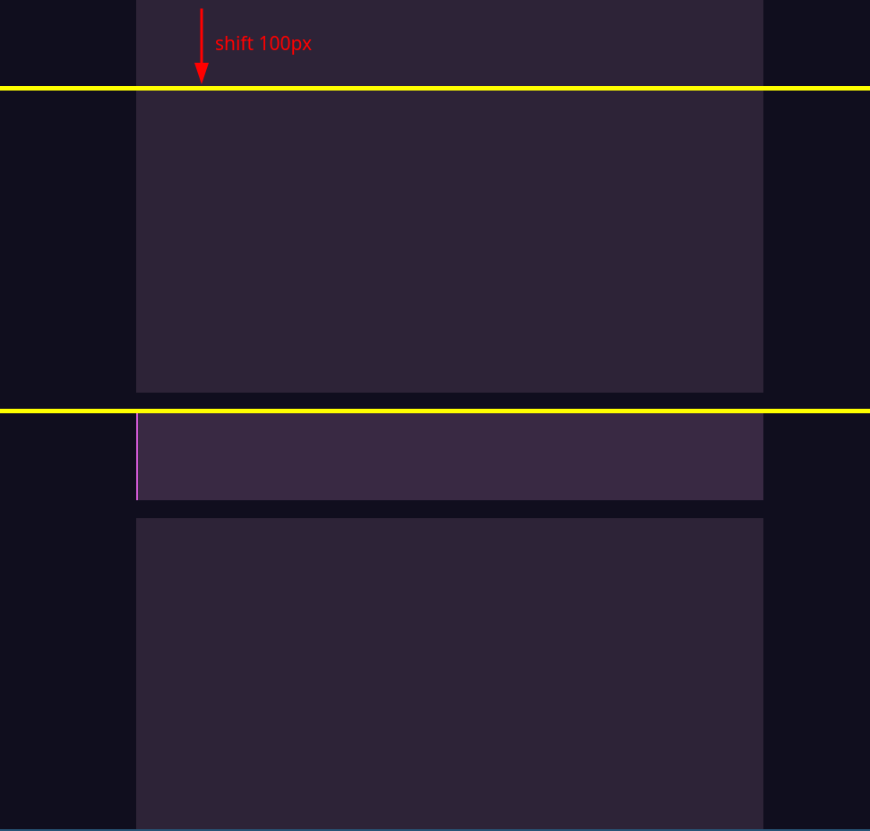
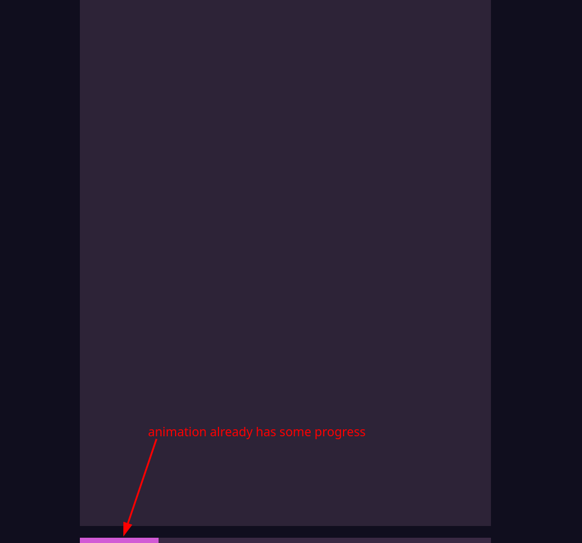
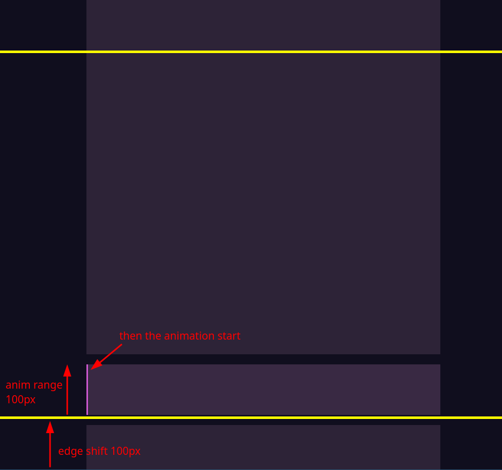

# view timeline inset

```html
  <body>
    <div class="container">
      <div class="content">
        <div style="height: 200vh; background-color: #2d2337"></div>
        <div class="progress">
          <div class="progress-inner"></div>
        </div>
        <div style="height: 200vh; background-color: #2d2337"></div>
      </div>
    </div>
  </body>
```

```css
body { ... }

.container {
  height: 100vh;
  overflow: auto;
  background-color: #100e1e;
}

.content {
  padding: 30px;
  max-width: 700px;
  margin: 0 auto;
}

.progress {
  width: 100%;
  height: 100px;
  background-color: rgb(57, 41, 67);
  position: relative;
  margin: 20px 0;
}
.progress-inner {
  position: absolute;
  height: 100%;
  top: 0;
  left: 0;
  background-color: rgb(209, 90, 213);
  view-timeline: --progress-view block;
  animation: animateWidth linear(0, 0.2, 1) both;
  animation-timeline: --progress-view;
  animation-range: 30% 70%; /* control where the animation starts and ends */
}

@keyframes animateWidth {
  from {
    width: 0;
  }
  to {
    width: 100%;
  }
}
```


In the example above, we used `animation-range` to control the start and end positions of the animation. This topic will introduce the use of another method - `view-timeline-inset` to control the start and end positions of the animation.


## What are edges in view timeline?

Edges refer to the starting and ending positions of the animation. By default, they are the top and bottom of the viewport. This means that the animation will start when the element enters the viewport and end when the element leaves the viewport.





## `view-timeline-inset` to shift the edges

`view-timeline-inset` is a property that allows you to shift the edges of the view timeline. This can be useful when you want to control where the animation starts and ends relative to the viewport.

```css
...
.container::before {
  content: "";
  position: fixed;
  top: 10%;
  width: 100%;
  height: 5px;
  z-index: 100;
  background: yellow;
}

.container::after {
  content: "";
  position: fixed;
  bottom: 50%;
  width: 100%;
  height: 5px;
  z-index: 100;
  background: yellow;
}
...
.progress-inner {
  position: absolute;
  height: 100%;
  top: 0;
  left: 0;
  background-color: rgb(209, 90, 213);
  view-timeline: --progress-view block;
  animation: animateWidth linear(0, 0.2, 1) both;
  animation-timeline: --progress-view;
  view-timeline-inset: 10% 50%; /* use `view-timeline-inset` to reset the edges */
}
...

```






## One value for `view-timeline-inset`

If you only provide one value for `view-timeline-inset`, it will apply that value to both the top and bottom edges. This is useful when you want to shift both edges by the same amount.


```css
.progress-inner {
  position: absolute;
  height: 100%;
  top: 0;
  left: 0;
  background-color: rgb(209, 90, 213);
  view-timeline: --progress-view block;
  animation: animateWidth linear(0, 0.2, 1) both;
  animation-timeline: --progress-view;
  view-timeline-inset: 30%;
  /*                   ^^^^ shift both edges by 30% */
}
```






## If only need to shift the buttom edge

If you only need to shift the bottom edge, you can use `auto` for the top edge. This will keep the top edge at its default position, while shifting the bottom edge by the specified value.

```css
.progress-inner {
  position: absolute;
  height: 100%;
  top: 0;
  left: 0;
  background-color: rgb(209, 90, 213);
  view-timeline: --progress-view block;
  animation: animateWidth linear(0, 0.2, 1) both;
  animation-timeline: --progress-view;
  view-timeline-inset: auto 50%;
  /*                   ^^^^ no shift for the top edge */
}
```



## Pixel values in `view-timeline-inset`

`view-timeline-inset` can also take pixel values, or mixed values (like `100px 50%`). This allows you to shift the edges by a specific number of pixels.

```css
.progress-inner {
  position: absolute;
  height: 100%;
  top: 0;
  left: 0;
  background-color: rgb(209, 90, 213);
  view-timeline: --progress-view block;
  animation: animateWidth linear(0, 0.2, 1) both;
  animation-timeline: --progress-view;
  view-timeline-inset: 100px 50%;
  /*                   ^^^^^ shift the top edge by 100px */
}
```




## `view-timeline-inset` value can be negative

`view-timeline-inset` can also take negative values, which allows you to shift the edges outside the viewport. Then the animation will start before it enters the viewport or end after it leaves the viewport.

```css
.progress-inner {
  position: absolute;
  height: 100%;
  top: 0;
  left: 0;
  background-color: rgb(209, 90, 213);
  view-timeline: --progress-view block;
  animation: animateWidth linear(0, 0.2, 1) both;
  animation-timeline: --progress-view;
  view-timeline-inset: auto -100%;
  /*                        ^^^^^ negative value */
}
```




## Combining `view-timeline-inset` with `animation-range`

`view-timeline-inset` can be combined with `animation-range` to control the start and end of the animation in a more flexible way.

```css
.progress-inner {
  position: absolute;
  height: 100%;
  top: 0;
  left: 0;
  background-color: rgb(209, 90, 213);
  view-timeline: --progress-view block;
  animation: animateWidth linear(0, 0.2, 1) both;
  animation-timeline: --progress-view;
  view-timeline-inset: 100px; /* inset the top and bottom edges by 100px */
  animation-range: 100px auto; /* further control the animation start place by 100px */
}
```



